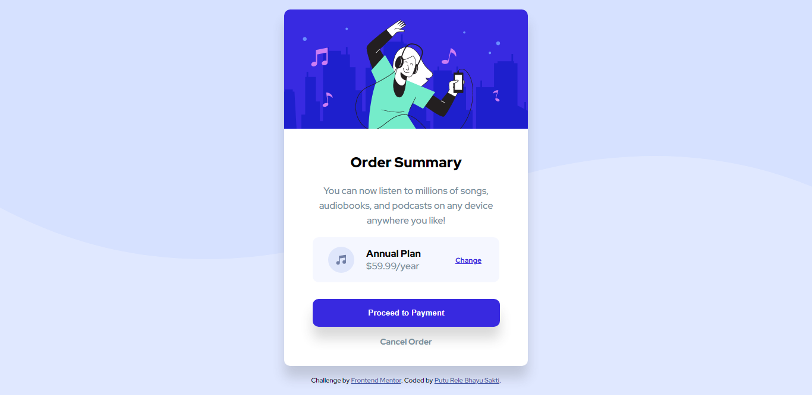
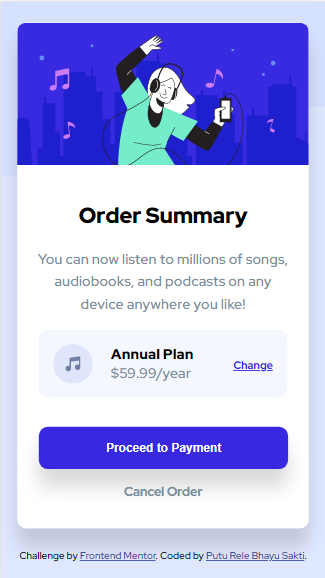

# Frontend Mentor - Order summary card solution

This is a solution to the [Order summary card challenge on Frontend Mentor](https://www.frontendmentor.io/challenges/order-summary-component-QlPmajDUj). Frontend Mentor challenges help you improve your coding skills by building realistic projects.

## Table of contents

- [Overview](#overview)
  - [The challenge](#the-challenge)
  - [Screenshot](#screenshot)
  - [Links](#links)
- [My process](#my-process)
  - [Built with](#built-with)
  - [What I learned](#what-i-learned)
  - [Continued development](#continued-development)
  - [Useful resources](#useful-resources)
- [Author](#author)

## Overview

### The challenge

Users should be able to:

- See hover states for interactive elements

### Screenshot

### Links

- Solution URL: [solution URL](https://www.frontendmentor.io/solutions/order-summary-solution-with-flexbox-and-css-grid--eK0qPFSt)
- Live Site URL: [live site URL](https://lere22.github.io/order-summary-chall/)

## My process

### Built with

- HTML5 markup
- CSS custom properties
- Flexbox
- CSS Grid
- Mobile-first workflow

### What I learned

What i learned from creating the project order summary is how to integrated not just web but with the mobile view and learned how to creating design and responsive design with css from scratch.

### Continued development

I want to continue this project to collaborate with my other projects in the future.

### Useful resources

- [Resource 1](https://fonts.google.com/specimen/Red+Hat+Display) - This helped me for choosing the font what i want.
- [Resource 2](https://www.freecodecamp.org/learn/responsive-web-design/) - This is an amazing course which helped me to understand the concept and workflow.
- [Resource 3](https://materialui.co/colors/) - This helped me for choosing the color while designing the app.
- [Resource 4](https://htmlcheatsheet.com/css/) - This cheatsheet helpep me while i forgot the syntax or the pattern. This is helpful.

## Author

- Code by - Putu Rele Bhayu Sakti
- Frontend Mentor - [@lere22](https://www.frontendmentor.io/profile/lere22)
